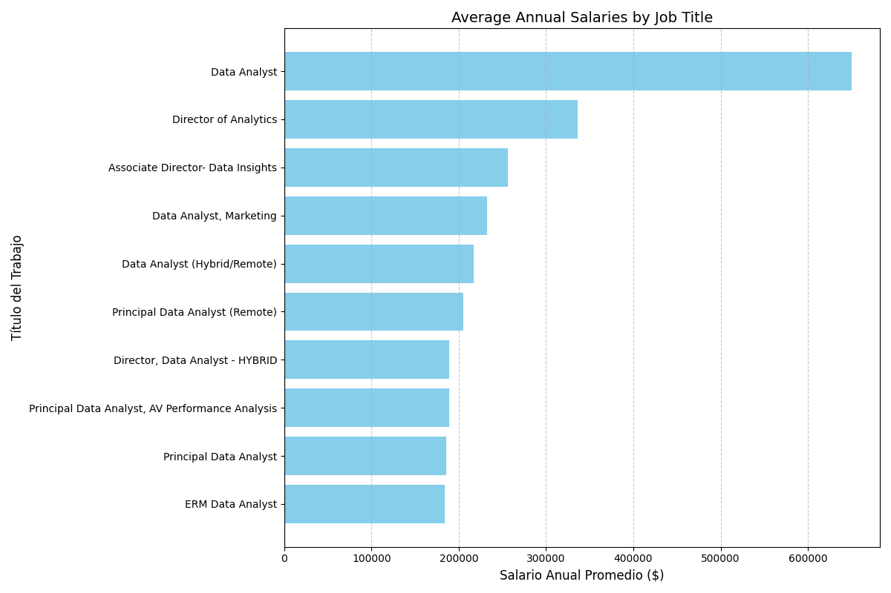
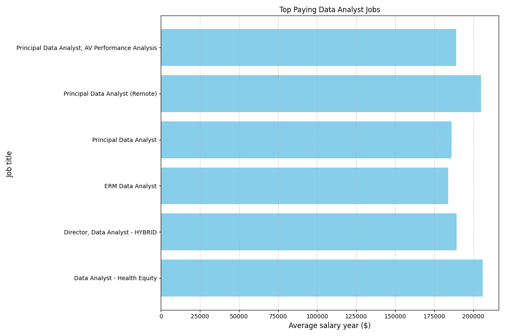

# Introduction
¡Welcome to my SQL Portfolio Project, where I delve into the data job market with a focus on data analyst roles. This project is a personal exploration into identifying the top-paying jobs, in-demand skills, and the intersection of high demand with high salary in the field of data analytics.

Check out my SQL queries here: [project_sql folder](/project_sql/)

# Background
he motivation behind this project stemmed from my desire to understand the data analyst job market better. I aimed to discover which skills are paid the most and in demand, making my job search more targeted and effective. 

The data for this analysis is from Luke Barousse’s SQL Course [SQL Course](https://www.youtube.com/watch?v=7mz73uXD9DA). This data includes details on job titles, salaries, locations, and required skills. 

## The questions I wanted to answer through my SQL queries were

1. What are the top-paying data analyst jobs?
2. What skills are required for these top-paying jobs?
3. What skills are most in demand for data analysts?
4. Which skills are associated with higher salaries?
5. What are the most optimal skills to learn for a data analyst looking to maximize job market value?
# Tools I Used
In this project, I utilized a variety of tools to conduct my analysis:

- **SQL** (Structured Query Language): Enabled me to interact with the database, extract insights, and answer my key questions through queries.
- **PostgreSQL**: As the database management system, PostgreSQL allowed me to store, query, and manipulate the job posting data.
- **Visual Studio Code:** This open-source administration and development platform helped me manage the database and execute SQL queries.
- **Git & GitHub** Essential for version control and sharing my SQL scripts and analysis, ensuring collaboration and project tracking.
# The Analysis
Each query for this project aimed at investigating specific aspects of the data analyst job market. Here’s how I approached each question:
# What I Learned
### 1. Top Paying Data Analyst Jobs

To identify the highest-paying roles, I filtered data analyst positions by average yearly salary and location, focusing on remote jobs. This query highlights the high paying opportunities in the field.
```SQL
SELECT
    job_id,
    job_title,
    job_location,
    job_schedule_type,
    salary_year_avg,
    job_posted_date
FROM
    job_postings_fact
WHERE
    job_title = 'Data Analyst'
    AND salary_year_avg IS NOT NULL
    AND job_location = 'Anywhere'
ORDER BY
    salary_year_avg DESC
LIMIT 10;
```
Here is the breakdown of the top data analyst jobs in 2023

- **Significant salary differences:** The chart shows a wide variation in average annual salaries among different job titles related to data analysis. For example, the highest salary corresponds to a "Data Analyst" at Mantys with an average of $650,000, while the lowest salary corresponds to an "ERM Data Analyst" at Get It Recruit - Information Technology with an average of $184,000.

- **Influence of job level on salary:** Positions with higher titles and greater responsibilities, such as "Director of Analytics" and "Associate Director- Data Insights," tend to have higher salaries compared to lower-level positions, such as "Data Analyst (Hybrid/Remote)" or "Data Analyst, Marketing." This reflects the typical compensation structure where leadership and management roles usually receive higher pay.





### 2. Skills for Top Paying Jobs
To understand what skills are required for the top-paying jobs, I joined the job postings with the skills data, providing insights into what employers value for high-compensation roles.

```SQL
-- Gets the top 10 paying Data Analyst jobs
WITH top_paying_jobs AS (
    SELECT
        job_id,
        job_title,
        salary_year_avg
    FROM
        job_postings_fact
    WHERE
        job_title_short = 'Data Analyst'
        AND salary_year_avg IS NOT NULL
        AND job_location = 'Anywhere'
    ORDER BY
        salary_year_avg DESC
    LIMIT 10
)
SELECT
    top_paying_jobs.job_id,
    top_paying_jobs.job_title,
    top_paying_jobs.salary_year_avg,
    skills_dim.skills
FROM
    top_paying_jobs
    INNER JOIN
    skills_job_dim ON top_paying_jobs.job_id = skills_job_dim.job_id
    INNER JOIN
    skills_dim ON skills_job_dim.skill_id = skills_dim.skill_id
ORDER BY
    top_paying_jobs.salary_year_avg DESC;
```
 **ERM Data Analyst at Get It Recruit - Information Technology:** 

- Average Annual Salary: $184,000.
- Required Skills: SQL, R, Python.

 **Principal Data Analyst at SmartAsset:**

- Average Annual Salary: $186,000.
- Required Skills: Excel, NumPy, Pandas, Snowflake, Go, SQL, Python, GitLab, Tableau.

**Principal Data Analyst, AV Performance Analysis at Motional:**

- Average Annual Salary: $189,000.
Required Skills: Python, Confluence, Jira, Atlassian, Bitbucket, Git, R, SQL.



### **What I Learned**

Throughout this project, I honed several key SQL techniques and skills:

- **Complex Query Construction**: Learning to build advanced SQL queries that combine multiple tables and employ functions like **`WITH`** clauses for temporary tables.
- **Data Aggregation**: Utilizing **`GROUP BY`** and aggregate functions like **`COUNT()`** and **`AVG()`** to summarize data effectively.
- **Analytical Thinking**: Developing the ability to translate real-world questions into actionable SQL queries that got insightful answers.

# In-Demand Skills for Data Analysts
This query helped identify the skills most frequently requested in job postings, directing focus to areas with high demand.
```SQL
SELECT
  skills_dim.skills,
  COUNT(skills_job_dim.job_id) AS demand_count
FROM
  job_postings_fact
  INNER JOIN
    skills_job_dim ON job_postings_fact.job_id = skills_job_dim.job_id
  INNER JOIN
    skills_dim ON skills_job_dim.skill_id = skills_dim.skill_id
WHERE
  job_postings_fact.job_title_short = 'Data Analyst'
GROUP BY
  skills_dim.skills
ORDER BY
  demand_count DESC
LIMIT 5;
```
| Skill | Demand Count |
|---|---|
| sql | 7291 |
| excel | 4611 |
| python | 4330 |
| tableau | 3745 |
| power bi | 2609 |

*Table of the demand for the top  5 skills in data analyst
job posting*
- **SQL** has the highest demand count (7291) and represents 28.7% of the total demand.
- **Excel and Python** follow closely behind, with demand counts of 4611 and 4330, respectively.
- **Tableau and Power BI** have lower demand counts but are still in high demand.

# Skills Based on Salary
Exploring the average salaries associated with different skills revealed which skills are the highest paying.

```SQL
SELECT 
    skills,
    ROUND(AVG(salary_year_avg), 0) AS avg_salary
FROM job_postings_fact
INNER JOIN skills_job_dim ON job_postings_fact.job_id = skills_job_dim.job_id
INNER JOIN skills_dim ON skills_job_dim.skill_id = skills_dim.skill_id
WHERE
    job_title_short = 'Data Analyst'
    AND salary_year_avg IS NOT NULL
    AND job_work_from_home = True 
GROUP BY
    skills
ORDER BY
    avg_salary DESC
LIMIT 25;
```
*Here's a breakdown of the results for top paying skills for Data Analysts:*

- **Big Data & Machine Learning:** Skills like PySpark, Jupyter notebooks, and Python libraries (Pandas, NumPy) are in high demand due to their importance in data processing and creating predictive models.

- **Software Development & Deployment:** Familiarity with tools like GitLab, Kubernetes, and Airflow indicates valuable crossover skills between data analysis and software engineering. These skills are crucial for automating tasks and managing data pipelines efficiently.

- **Cloud Computing Expertise:** Knowing cloud-based tools like Elasticsearch, Databricks, and GCP is essential as data analysis is increasingly moving to the cloud. Cloud proficiency can significantly increase your earning potential.
In short, data analysts with expertise in these areas are highly sought-after and can command top salaries.

| job_title_short | salary_job | skills      |
|-----------------|-------------|-------------|
| Data Analyst    | 400000      | svn         |
| Data Analyst    | 179000      | solidity    |
| Data Analyst    | 160515      | couchbase   |
| Data Analyst    | 155486      | datarobot   |
| Data Analyst    | 155000      | golang      |
| Data Analyst    | 149000      | mxnet       |
| Data Analyst    | 147633      | dplyr       |
| Data Analyst    | 147500      | vmware      |
| Data Analyst    | 146734      | terraform   |
| Data Analyst    | 138500      | twilio      |
| Data Analyst    | 134126      | gitlab      |
| Data Analyst    | 129999      | kafka       |
| Data Analyst    | 129820      | puppet      |
| Data Analyst    | 127013      | keras       |
| Data Analyst    | 125226      | pytorch     |
| Data Analyst    | 124686      | perl        |
| Data Analyst    | 124370      | ansible     |
| Data Analyst    | 123950      | hugging face|
| Data Analyst    | 120647      | tensorflow  |
| Data Analyst    | 118407      | cassandra   |
| Data Analyst    | 118092      | notion      |
| Data Analyst    | 117966      | atlassian   |
| Data Analyst    | 116712      | bitbucket   |
| Data Analyst    | 116387      | airflow     |
| Data Analyst    | 115480      | scala       |

*Table of the average salary for the top 10 paying skills for data analysts*

## 5. Most Optimal Skills to Learn
- **Combining insights from demand and salary data, this query aimed to pinpoint skills that are both in high demand and have high salaries, offering a strategic focus for skill development.**

``` SQL
WITH skills_demand AS (
  SELECT
    skills_dim.skill_id,
    skills_dim.skills,
    COUNT(skills_job_dim.job_id) AS demand_count
  FROM
    job_postings_fact
    INNER JOIN
    skills_job_dim ON job_postings_fact.job_id = skills_job_dim.job_id
    INNER JOIN
    skills_dim ON skills_job_dim.skill_id = skills_dim.skill_id
  WHERE
    job_postings_fact.job_title_short = 'Data Analyst'
    AND job_postings_fact.salary_year_avg IS NOT NULL
    AND job_postings_fact.job_location = 'Anywhere'
  GROUP BY
    skills_dim.skill_id
),
average_salary AS (
  SELECT
    skills_job_dim.skill_id,
    AVG(job_postings_fact.salary_year_avg) AS avg_salary
  FROM
    job_postings_fact
    INNER JOIN
    skills_job_dim ON job_postings_fact.job_id = skills_job_dim.job_id
  WHERE
    job_postings_fact.job_title_short = 'Data Analyst'
    AND job_postings_fact.salary_year_avg IS NOT NULL
    AND job_postings_fact.job_location = 'Anywhere'
  GROUP BY
    skills_job_dim.skill_id
)
SELECT
  skills_demand.skills,
  skills_demand.demand_count,
  ROUND(average_salary.avg_salary, 2) AS avg_salary
FROM
  skills_demand
  INNER JOIN
  average_salary ON skills_demand.skill_id = average_salary.skill_id
ORDER BY
  demand_count DESC,
  avg_salary DESC
LIMIT 10;
```

### Highlighting skill development: 

By working on this project, I not only got answers to specific questions using SQL, but I also honed my understanding of the language and database analysis as a whole.  I learned to harness the power of SQL's data manipulation tools to extract meaningful insights from challenging datasets.

### **What I Learned**

Throughout this project, I honed several key SQL techniques and skills:

- **Complex Query Construction**: Learning to build advanced SQL queries that combine multiple tables and employ functions like **`WITH`** clauses for temporary tables.
- **Data Aggregation**: Utilizing **`GROUP BY`** and aggregate functions like **`COUNT()`** and **`AVG()`** to summarize data effectively.
- **Analytical Thinking**: Developing the ability to translate real-world questions into actionable SQL queries that got insightful answers.
 
 ### **Insights**

From the analysis, several general insights emerged:

1. **Top-Paying Data Analyst Jobs**: The highest-paying jobs for data analysts that allow remote work offer a wide range of salaries, the highest at $650,000!
2. **Skills for Top-Paying Jobs**: High-paying data analyst jobs require advanced proficiency in SQL, suggesting it’s a critical skill for earning a top salary.
3. **Most In-Demand Skills**: SQL is also the most demanded skill in the data analyst job market, thus making it essential for job seekers.
4. **Skills with Higher Salaries**: Specialized skills, such as SVN and Solidity, are associated with the highest average salaries, indicating a premium on niche expertise.
5. **Optimal Skills for Job Market Value**: SQL leads in demand and offers for a high average salary, positioning it as one of the most optimal skills for data analysts to learn to maximize their market value.


#  Conclusions
- **This project was a win-win for my SQL skills and my data analyst career aspirations.  By analyzing the job market, I gained valuable insights into which skills are most in-demand and offer the highest salaries. This knowledge allows aspiring data analysts, like myself, to prioritize their skill development and tailor their job search efforts to focus on the most valuable areas.  The project also reinforces the importance of lifelong learning in the ever-evolving field of data analytics.**